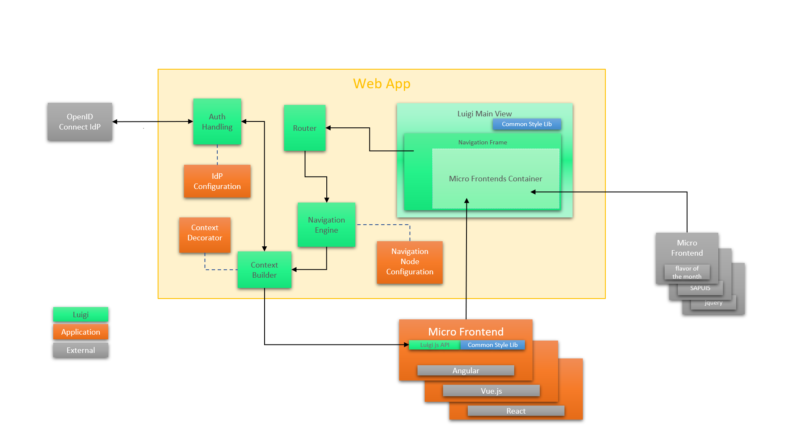

## Details
### You will learn
  - What micro-frontends are
  - What the Luigi project is
  - Luigi terminology

---

[ACCORDION-BEGIN [Step 1:](What are micro-frontends?)]

Micro-frontends are often called "microservices for the front-end". They allow you to break down large monolith front-ends into independent, scalable, individual parts which work together. Micro-frontend architecture is especially useful for complex products or companies with many teams and can help you create consistent web applications.

Watch this video which explains the basics of micro-frontend architecture and how it can be implemented with Luigi:

<iframe width="560" height="315" src="https://www.youtube.com/embed/Bjp1_yvtR4Y" frameborder="0" allowfullscreen></iframe>

[DONE]
[ACCORDION-END]

[ACCORDION-BEGIN [Step 2: ](What is Luigi?)]

[Luigi](https://luigi-project.io) is an open source micro-frontend framework written in Svelte. It allows you to create a consistent user interface and navigation, while also offering additional features to make development easier. Its appearance is based on Fundamentals Library Styles. Luigi is technology agnostic, allowing you to build your app and add micro-frontends to it using React, Angular, UI5, or any other technology.

[Luigi Fiddle](https://fiddle.luigi-project.io) is a test playground where you can get a feel for Luigi.

This diagram portrays the basic architecture of Luigi:

[DONE]
[ACCORDION-END]

---
